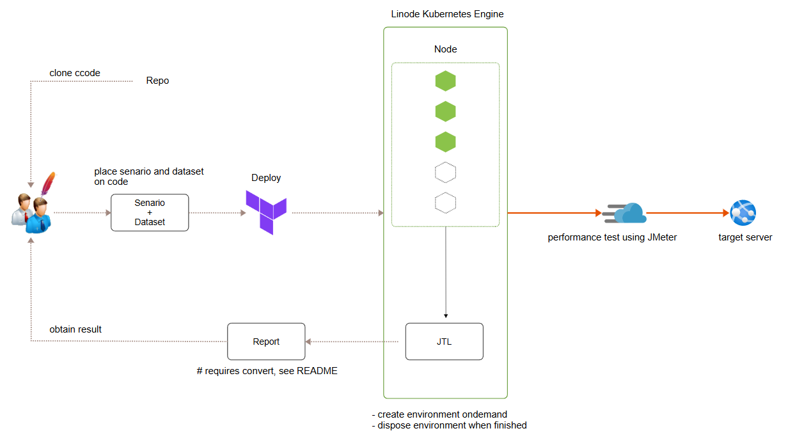

# Overview



Linode Kubernets Engine(LKE)上でJMeterを使用して負荷テストを実行する  
負荷テストの実行結果はjtl形式のファイルを得て、JMeterのプラグインを使用してAggregate ReportのCSV形式で最終的にアウトプットする

# Get Start

LinodeのAPI tokenで下記の権限のものが必要になります。  
[Linode CLIのインストール](https://qiita.com/isss802/items/0b1be79031ee16ced521)を参照

```
ips:read_only linodes:read_only lke:read_write
```

一週間有効なtokenを作成する例

```
expire=`date -d '+7 day' '+%Y-%m-%dT00:00:00'`
linode-cli profile token-create \
  --scopes "ips:read_only linodes:read_only lke:read_write" \
  --expiry "$expire" \
  --label temp-token-until-$expire
```

1. testフォルダ内のtest.jmxにJMeterで作成したシナリオを上書きする
2. データセットのCSVを同フォルダに含める (CSVを使わないテストの場合は`start_test.sh`を使用)
3. リポジトリをカレントディレクトリにして以下を実行

```
export TF_VAR_token={{linode token}}
terraform init
terraform plan
terraform apply -auto-approve
echo "have a break" && sleep 60
export KUBE_VAR=`terraform output -raw kubeconfig` && echo $KUBE_VAR | base64 -d > jmeter-perf-kubeconfig.yaml
export KUBECONFIG=jmeter-perf-kubeconfig.yaml
./jmeter_cluster_create.sh
echo "have a break" && sleep 10
./start_test_csv.sh test
terraform destroy -auto-approve
```

4. 負荷テストが実行され結果ファイル `out.jtl.gz` が取得できたら内容をCSV形式に変換(下段参照)し、負荷テスト終了

# 留意点

## 実行環境の性能の調整

以下の2つのファイルによって制御します

> variables.tf

`type`と`count`の値でVMのサイズと台数が決まります。

> jmeter_slaves_deploy.yaml

`replicas`の数がslaveとなるkubernetes上のpodの数になります。
デフォルトではslaveのpodは3セットになります。
VMの台数が増える場合はこの値もスケールすることで並列性能が上がることが期待できますが、
この数値を増やすと実行計画のスレッド数やループ数の再調整が必要になります。

## テスト計画が正しく動作することの事前確認

全てのテストが2回程度で完了するようにスレッドグループを調整し、
ローカルですべてのシナリオが期待した動作をしていることを確認してから
目的の負荷量になるようにスレッド値、ループ数等を調整してjmxを保存してください。  
また、実行環境はHeadlessなのでリスナーはすべて無効にしておいてください。ローカル実行時はリスナー有効でも問題ありません。

## 特殊なJMeterプラグインを使用する場合

JMeter実行環境には特別な実行プログラムを追加で実行するためのセットアップは事前には準備されていません。
そのようなものが必要な場合、コンテナにもデプロイされるようにコードを修正する必要があります。

## CSVの配置について

jmxと同じ階層にデータセットとなるcsvは配置してください。  
JMeterのシナリオでCSVへの絶対パス指定を行うと、コンテナ展開時にエラーが発生するためファイル名のみを記述します。

# jtlをcsvに変換する手順

1. {jmeterのディレクトリ}\libにcmdrunner-2.2と2.3を入れる  
http://search.maven.org/remotecontent?filepath=kg/apc/cmdrunner/2.2/cmdrunner-2.2.jar  
http://search.maven.org/remotecontent?filepath=kg/apc/cmdrunner/2.3/cmdrunner-2.3.jar

2. {jmeterのディレクトリ}\lib\extにplugin mangerを入れる  
https://jmeter-plugins.org/get/

3. {jmeterのディレクトリ}\binで以下実行

```
java -cp ..\lib\ext\jmeter-plugins-manager-1.10.jar org.jmeterplugins.repository.PluginManagerCMDInstaller
```

4. プラグインインストール

```
.\PluginsManagerCMD.bat install jpgc-cmd,jpgc-synthesis
```

5. jtlをcsvに変換

```
.\JMeterPluginsCMD.bat --generate-csv C:\mytest\99999\test\out.csv --input-jtl mytest\99999\test\out.jtl --plugin-type AggregateReport
```

# 付録

DockerイメージおよびScriptはkubernautsを参照しています。  
The Docker images and scripts are referencing Kubernauts.
https://github.com/kubernauts/jmeter-kubernetes
